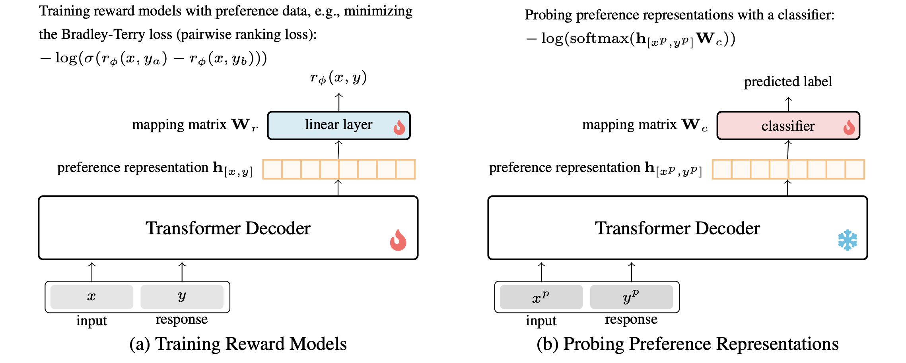

# Probing Preference Representations: A Multi-Dimensional Evaluation and Analysis Method for Reward Models

## Introduction
We introduce **MRMBench**, a comprehensive benchmark for evaluating reward models across six key preference dimensions: harmlessness, helpfulness, correctness, coherence, complexity, and verbosity. *Unlike traditional pairwise-ranking evaluations that reduce preference learning to a single binary choice, MRMBench probes whether reward models genuinely encode rich, multi-dimensional human preferences.* We further propose **inference-time probing**, a simple yet effective analysis method that identifies which preference dimensions a reward model relies on during prediction, enhancing interpretability and revealing potential failure modes. Our paper is available at this [link](https://arxiv.org/abs/2511.12464).



## Getting Started


### Installation
You can use anaconda/miniconda to install packages needed for this project.

```bash
pip install -r requirements.txt
```
### Data

See [our huggingface](https://huggingface.co/datasets/ifnoc/MRMBench) for more details.

### Evaluation

For MRMBench-Easy evaluation:
```bash
bash ./scripts/evaluate_MRMBench-Easy.sh
```

For MRMBench-Hard evaluation:
```bash
bash ./scripts/evaluate_MRMBench-Hard.sh
```

### Evaluation Results
We present a subset of evaluation results for several reward models on MRMBench. Additional results can be found in our full [paper](https://arxiv.org/abs/2511.12464).

### **MRMBench-Easy**

| Model Name     | Params | Har. | Hel. | Cor. | Coh. | Com. | Ver. | Avg. |
| --------------------------------------------- | :----: | :--: | :--: | :--: | :--: | :--: | :--: | :--: |
| **–– 13B models––**   |        |      |      |      |      |      |      |      |
| allenai/tulu-2-dpo-13b                        |   13B  | 80.2 | 66.1 | 70.6 | 72.0 | 90.7 | 82.1 | 76.9 |
| openbmb/UltraRM-13B                           |   13B  | 54.5 | 74.5 | 72.6 | 90.9 | 82.2 | 71.7 | 74.4 |
| meta-llama/LLaMA-2-13B-Chat        |   13B  | 78.1 | 61.3 | 66.4 | 68.3 | 86.4 | 80.5 | 73.5 |
| **–– 8B models––**   |        |      |      |      |      |      |      |      |
| general-preference/GPM-LLaMA-3.1-8B           |   8B   | 90.9 | 71.1 | 72.6 | 69.9 | 91.1 | 82.2 | 79.6 |
| nicolinho/QRM-LLaMA-3.1-8B-v2                 |   8B   | 86.5 | 69.8 | 70.3 | 69.6 | 91.1 | 79.9 | 77.9 |
| sfairXC/FsfairX-LLaMA3-RM-v0.1                |   8B   | 83.2 | 66.0 | 69.8 | 68.8 | 90.8 | 79.5 | 76.4 |
| Ray2333/GRM-LLaMA-3-8B-rewardmodel-ft         |   8B   | 82.0 | 66.1 | 68.7 | 69.1 | 90.9 | 80.0 | 76.1 |
| meta-llama/LLaMA-3.1-8B-Instruct    |   8B   | 80.4 | 66.3 | 69.4 | 67.0 | 89.1 | 79.1 | 75.2 |
| meta-llama/LLaMA-3-8B-Instruct      |   8B   | 77.1 | 63.2 | 61.8 | 62.8 | 87.6 | 78.3 | 71.8 |
| **–– 7B models ––**                           |        |      |      |      |      |      |      |      |
| openbmb/Eurus-RM-7B                           |   7B   | 82.2 | 70.0 | 72.1 | 72.7 | 90.9 | 82.2 | 78.4 |
| weqweasdas/RM-Mistral-7B                      |   7B   | 67.3 | 70.9 | 74.5 | 72.6 | 90.9 | 81.2 | 76.2 |
| CIR-AMS/BTRM-Qwen2-7b-0613                    |   7B   | 73.5 | 63.4 | 64.7 | 64.4 | 87.6 | 74.3 | 71.3 |
| mistralai/Mistral-7B-Instruct-v0.2  |   7B   | 68.6 | 60.0 | 62.5 | 63.2 | 85.2 | 72.0 | 68.5 |
| **–– 2B models ––**                           |        |      |      |      |      |      |      |      |
| general-preference/GPM-Gemma-2B               |   2B   | 74.0 | 63.8 | 66.1 | 70.5 | 90.9 | 82.1 | 74.6 |
| weqweasdas/RM-Gemma-2B                        |   2B   | 54.5 | 71.7 | 74.5 | 72.5 | 90.9 | 82.2 | 74.4 |
| google/Gemma-2-2B                   |   2B   | 68.7 | 60.1 | 58.8 | 64.9 | 88.4 | 74.2 | 69.2 |

---

### **MRMBench-Hard**

| Model Name                                    | Params | Har. | Hel. | Cor. | Coh. | Com. | Ver. | Avg. |
| --------------------------------------------- | :----: | :--: | :--: | :--: | :--: | :--: | :--: | :--: |
| **–– 13B models––**   |        |      |      |      |      |      |      |      |
| allenai/tulu-2-DPO-13B                        |   13B  | 70.1 | 68.6 | 43.8 | 71.2 | 61.3 | 66.6 | 63.6 |
| openbmb/UltraRM-13B                           |   13B  | 48.0 | 69.5 | 47.1 | 72.6 | 59.7 | 62.1 | 59.8 |
| meta-llama/Llama-2-13B-chat         |   13B  | 73.1 | 62.5 | 37.4 | 65.2 | 57.1 | 63.4 | 59.8 |
| **–– 8B models ––**                           |        |      |      |      |      |      |      |      |
| general-preference/GPM-LLaMA-3.1-8B           |   8B   | 87.3 | 71.8 | 51.5 | 68.6 | 59.6 | 63.0 | 67.0 |
| nicolinho/QRM-LLaMA-3.1-8B-v2                 |   8B   | 81.7 | 68.3 | 49.3 | 68.6 | 58.7 | 60.5 | 64.5 |
| Ray2333/GRM-LLaMA-3-8B-rewardmodel-ft         |   8B   | 79.1 | 68.9 | 44.9 | 69.5 | 58.9 | 64.8 | 64.3 |
| sfairXC/FsfairX-LLaMA3-RM-v0.1                |   8B   | 81.4 | 67.7 | 44.9 | 69.0 | 58.4 | 62.9 | 64.0 |
| meta-llama/LLaMA-3.1-8B-Instruct    |   8B   | 75.6 | 64.1 | 46.5 | 67.6 | 56.1 | 61.9 | 62.0 |
| meta-llama/LLaMA-3-8B-Instruct      |   8B   | 72.2 | 62.4 | 42.4 | 68.1 | 55.1 | 54.2 | 59.1 |
| **–– 7B models ––**                           |        |      |      |      |      |      |      |      |
| openbmb/Eurus-RM-7B                           |   7B   | 79.8 | 72.8 | 47.0 | 72.6 | 59.3 | 65.3 | 66.1 |
| weqweasdas/RM-Mistral-7B                      |   7B   | 79.3 | 71.7 | 28.2 | 21.4 | 38.2 | 62.5 | 50.2 |
| CIR-AMS/BTRM-Qwen2-7b-0613                    |   7B   | 70.1 | 55.7 | 28.1 | 17.9 | 39.6 | 46.0 | 42.9 |
| mistralai/Mistral-7B-Instruct-v0.2  |   7B   | 72.0 | 55.9 | 29.0 | 17.9 | 40.8 | 54.1 | 45.0 |
| **–– 2B models ––**                           |        |      |      |      |      |      |      |      |
| general-preference/GPM-Gemma-2B               |   2B   | 73.6 | 68.8 | 43.3 | 70.5 | 56.1 | 62.1 | 62.4 |
| google/Gemma-2-2B                   |   2B   | 68.4 | 64.2 | 36.0 | 63.8 | 54.7 | 59.5 | 57.8 |
| weqweasdas/RM-Gemma-2B                        |   2B   | 45.5 | 71.7 | 27.2 | 21.5 | 38.2 | 62.1 | 44.4 |


### Citation
```
@article{wang2025probing,
      title={Probing Preference Representations: A Multi-Dimensional Evaluation and Analysis Method for Reward Models}, 
      author={Chenglong Wang and Yifu Huo and Yang Gan and Yongyu Mu and Qiaozhi He and Murun Yang and Bei Li and Chunliang Zhang and Tongran Liu and Anxiang Ma and Zhengtao Yu and Jingbo Zhu and Tong Xiao},
      year={2025},
      eprint={2511.12464},
      archivePrefix={arXiv},
      primaryClass={cs.CL},
      url={https://arxiv.org/abs/2511.12464}, 
}
```

### Acknowledgement

We thank the contributions of the following papers:
```
[1] Wang, Zhilin, et al. "Helpsteer: Multi-attribute helpfulness dataset for steerlm." Proceedings of the 2024 Conference of the North American Chapter of the Association for Computational Linguistics: Human Language Technologies (Volume 1: Long Papers). 2024.  
[2] Wang, Zhilin, et al. "Helpsteer 2: Open-source dataset for training top-performing reward models." Advances in Neural Information Processing Systems 37 (2024): 1474-1501.  
[3] Ji, Jiaming, et al. "Pku-saferlhf: Towards multi-level safety alignment for llms with human preference." Proceedings of the 63rd Annual Meeting of the Association for Computational Linguistics (Volume 1: Long Papers). 2025.  
```
