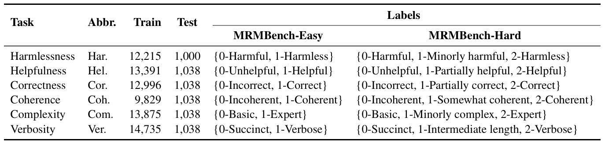
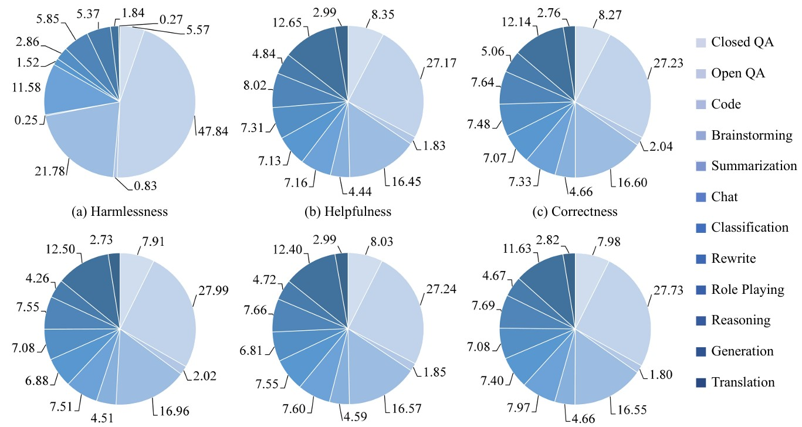

## Overview

The data statistics are as follows:




### File hierachy


```
data
├─ mrm_easy
│    ├─ coherence
│    │    ├─ test.json
│    │    └─ train.json
│    ├─ complexity
│    │   ... ...
... ...
│    └─ verbosity
│        ... ...
└─ mrm_hard
       ├─ coherence
       │    ├─ test.json
       │    └─ train.json
    ... ...
```

### Description

In the MRMBench evaluation pipeline:

1. A reward model is trained on the `train.json` file for a given task.
2. The model's accuracy is then evaluated on the corresponding `test.json` file.

In each `.json` file, the format of data is:

```json
[
    {
        "input": "explain master slave replication nsql",
        "output": "In the context of NoSQL ... ...",
        "label": 1
    },
    ......
        {
        "input": "generate prompts that ... ...",
        "output": "Sure, here are some prompts ... ...",
        "label": 0
    },
    ......
]
```